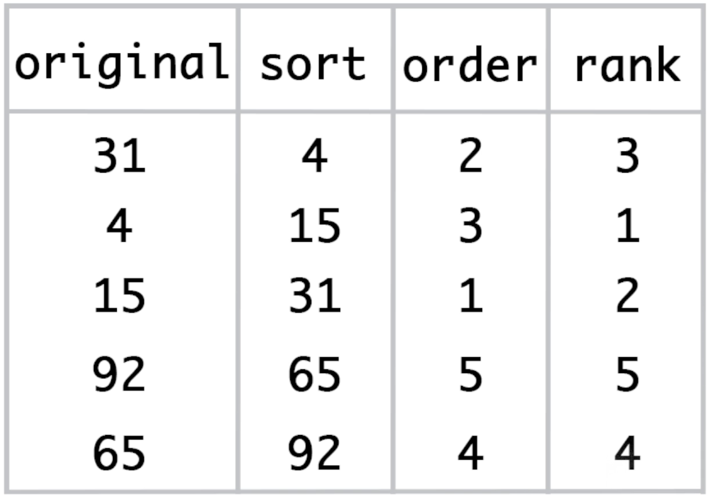
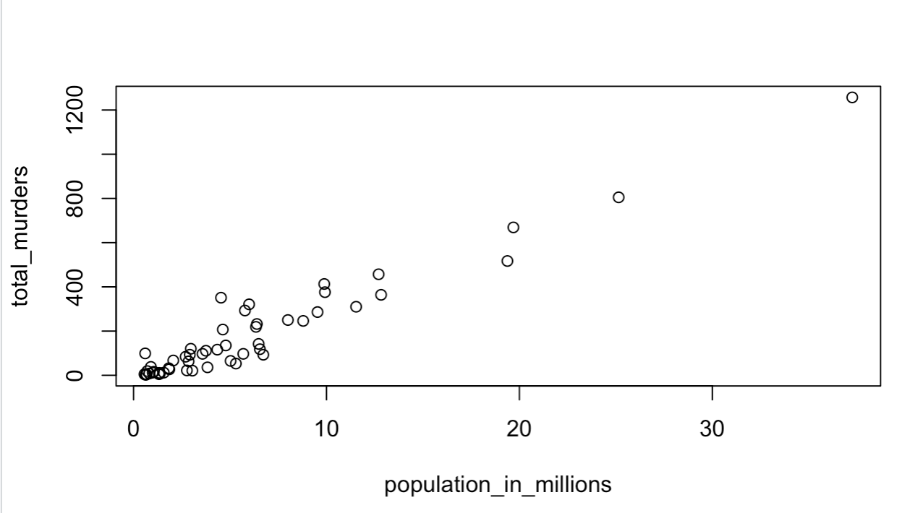
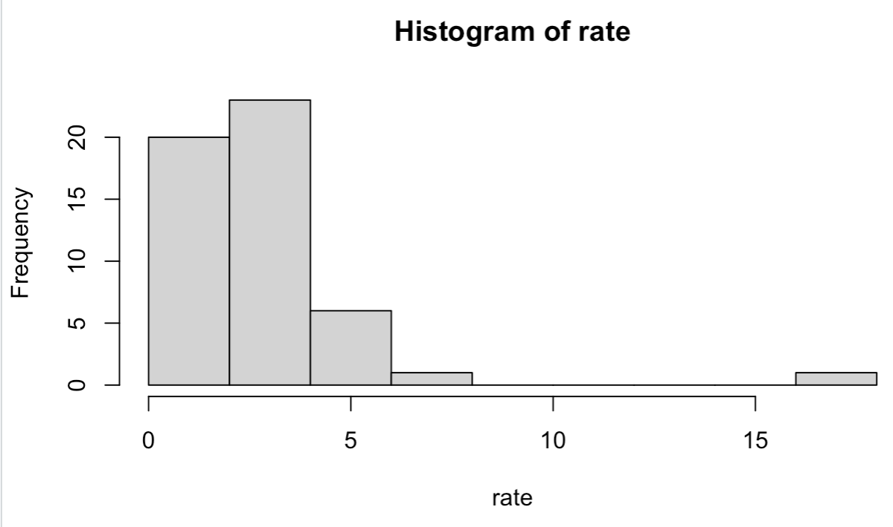
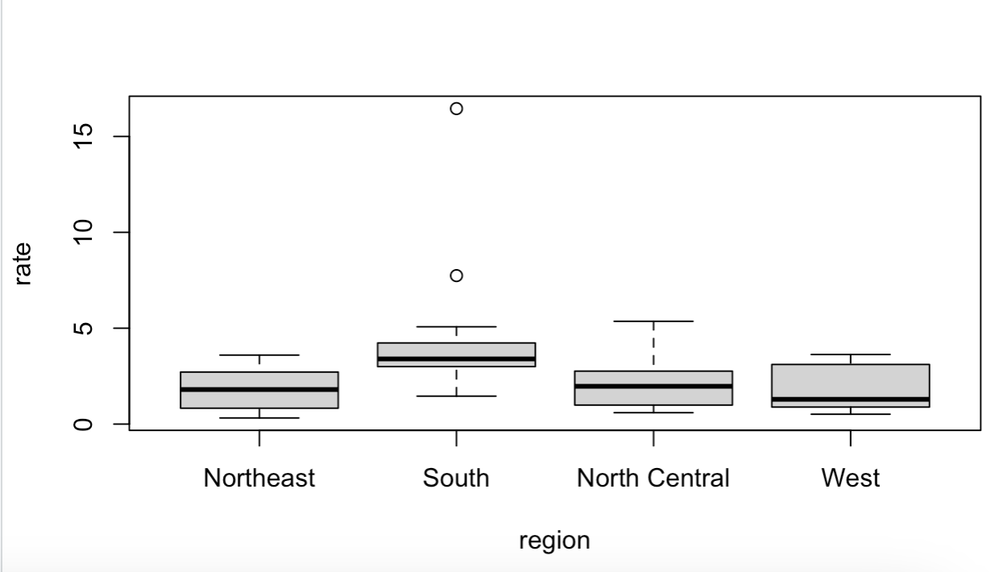
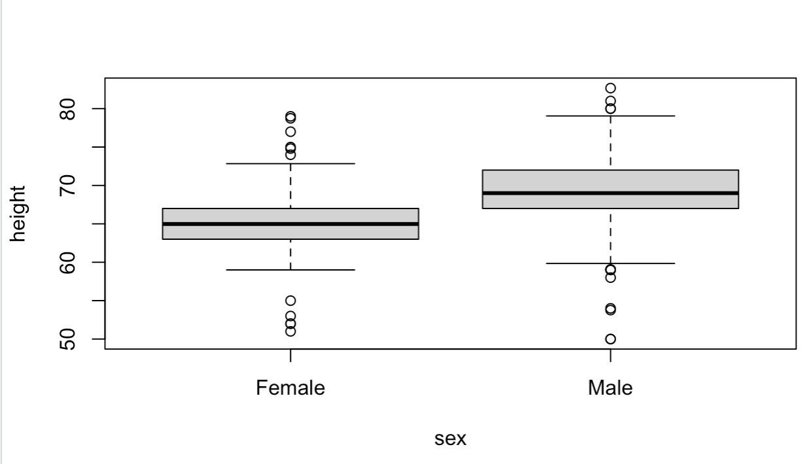
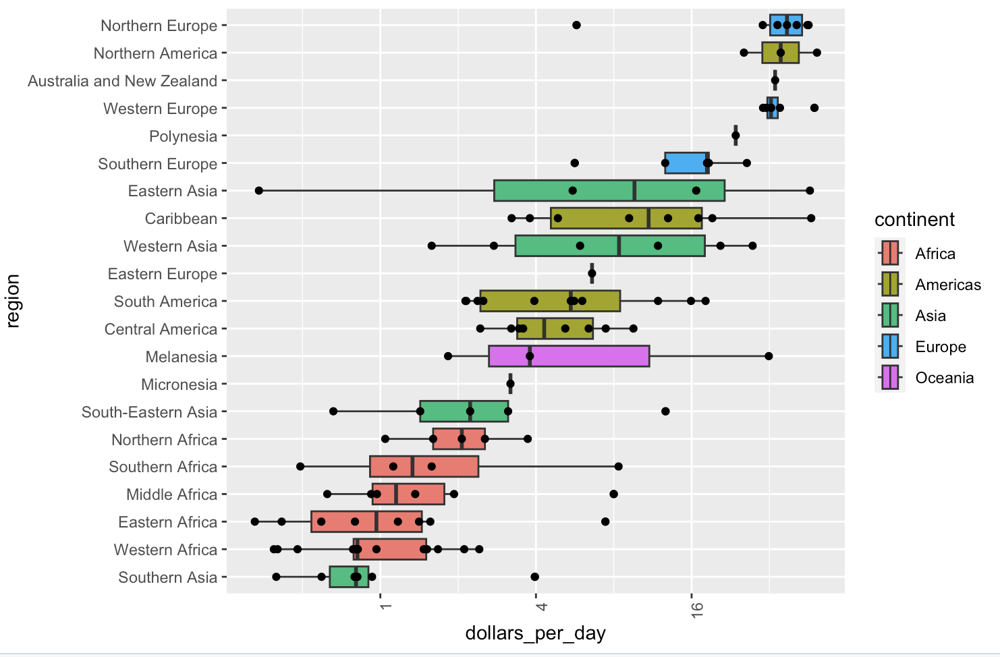

## Data Frames

### Creating a data frame
grades <- data.frame(names = c("John", "Juan", "Jean", "Yao"), 
                     exam_1 = c(95, 80, 90, 85), 
                     exam_2 = c(90, 85, 85, 90),
                     stringsAsFactors = FALSE)


Load the library `dslabs`:

`library(dslabs)`

There are multiple data sets available in this library. We can consult all available:

`data()`

Ask for the data type of murders, or the structure of the data.

```
> class(murders)
[1] "data.frame"

> str(murders)
'data.frame':	51 obs. of  5 variables:
 $ state     : chr  "Alabama" "Alaska" "Arizona" "Arkansas" ...
 $ abb       : chr  "AL" "AK" "AZ" "AR" ...
 $ region    : Factor w/ 4 levels "Northeast","South",..: 2 4 4 2 4 4 1 2 2 2 ...
 $ population: num  4779736 710231 6392017 2915918 37253956 ...
 $ total     : num  135 19 232 93 1257 ...
```

Ask for the row with the higher murder rate:

```
> rate <- murders$total/murders$population*100000
> max <- which.max(rate)
> murders[max,]
                 state abb region population total
9 District of Columbia  DC  South     601723    99
```



If we want the rows in which the rate is lower than a certain threashold we have:

```
> murders[rate<0.71,]
           state abb        region population total
12        Hawaii  HI          West    1360301     7
16          Iowa  IA North Central    3046355    21
30 New Hampshire  NH     Northeast    1316470     5
35  North Dakota  ND North Central     672591     4
46       Vermont  VT     Northeast     625741     2
```

For multiple conditions:
```
> murders[rate<1 & murders$region == "West",]
     state abb region population total
12  Hawaii  HI   West    1360301     7
13   Idaho  ID   West    1567582    12
38  Oregon  OR   West    3831074    36
45    Utah  UT   West    2763885    22
51 Wyoming  WY   West     563626     5
```

## dplyr Library

Add new column to a data frame:

```
> mutate(murders, rate=rate)
                  state abb        region population total       rate
1               Alabama  AL         South    4779736   135  2.8244238
2                Alaska  AK          West     710231    19  2.6751860
3               Arizona  AZ          West    6392017   232  3.6295273
...

```

Other examples are `filter`, and `select`.

Example of usage of pipe operator `%>%`:

```
murders %>% mutate(rate=rate) %>% select(state, region, rate) %>% filter(rate<1)
           state        region      rate
1         Hawaii          West 0.5145920
2          Idaho          West 0.7655102
3           Iowa North Central 0.6893484
4          Maine     Northeast 0.8280881
5      Minnesota North Central 0.9992600

```

### Plotting

Point graph:

```
> population_in_millions <- murders$population/10^6
> total_murders <- murders$total
> plot(population_in_millions, total_murders)
```



Histogram:
```
hist(rate)
```



One can also use bloxplots to compare the same information in different parameters. An example is showing the rate based on the region.

```
boxplot(rate~region, data = murders)
```



## Data Visualization

Lets use the data set of heights:

```
> data(heights)
```

We can find the proportion of man and woman. And present some bloxplots based on the sex:

```
> prop.table(table(heights$sex))

   Female      Male 
0.2266667 0.7733333

> boxplot(height~sex, data = heights)
```



### ggplot2

ggplot2 allows visualizing data in a more complex way.

Plots in ggplot2 consist of 3 main components:
- **Data**: The dataset being summarized
- **Geometry**: The type of plot (scatterplot, boxplot, barplot, histogram, qqplot, smooth density, etc.)
- **Aesthetic mapping**: Variables mapped to visual cues, such as x-axis and y-axis values and color

There are additional components such as:
- Scale
- Labels, Title, Legend
- Theme/Style

## Gapminder Dataset

We will use real data to answer the following questions about world health and economics:
Is it still fair to consider the world as divided into the West and the developing world?
Has income inequality across countries worsened over the last 40 years?

### Redorder function
```
fac <- factor(c("Asia", "Asia", "West", "West", "West"))
levels(fac)

value <- c(10, 11, 12, 6, 4)
fac <- reorder(fac, value, FUN = mean)
levels(fac)
```

### Boxplots
```
library(dslabs)
data(gapminder)

gapminder %>%
  filter(year == 1970 & !is.na(gdp)) %>%
  mutate(dollars_per_day = gdp/population/365) %>%
  mutate(region = reorder(region, dollars_per_day, FUN = median)) %>%
  ggplot(aes(dollars_per_day, region, fill = continent)) +
  geom_boxplot() +
  theme(axis.text.x = element_text(angle = 90, hjust = 1)) +
  scale_x_continuous(trans = "log2") +
  geom_point(show.legend = FALSE)
```


